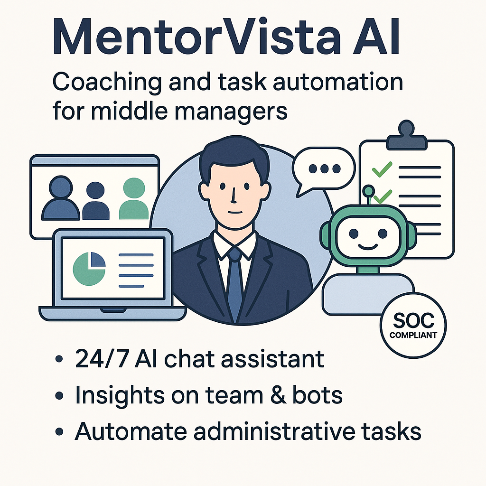
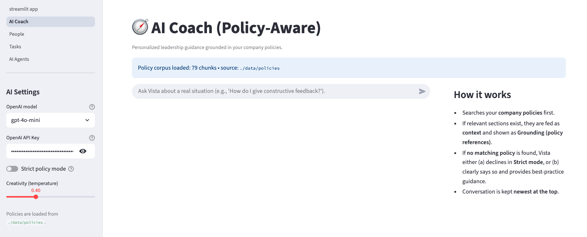
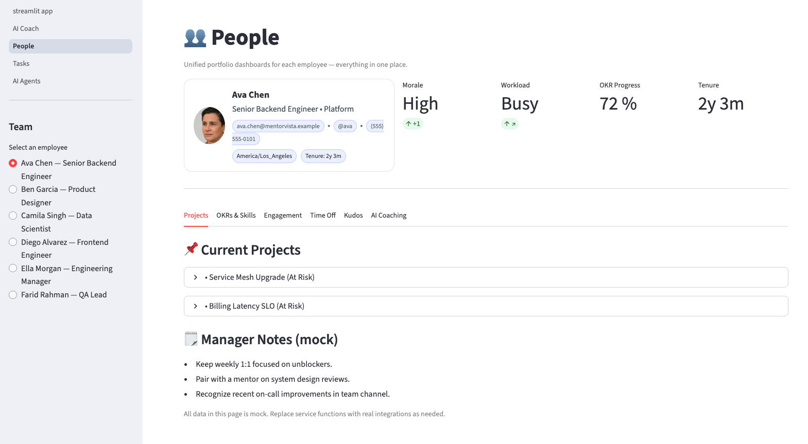
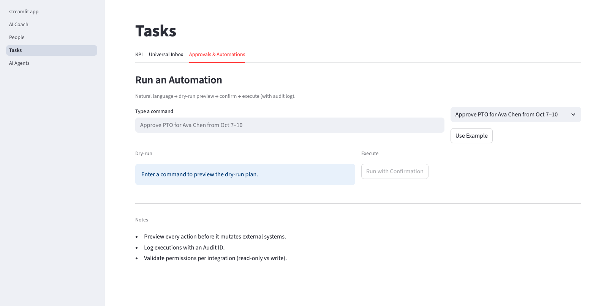
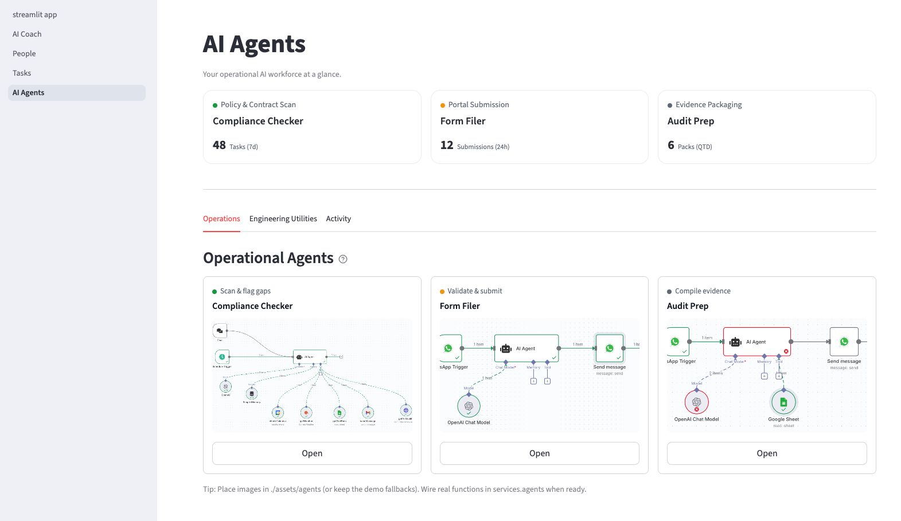

# MentorVista – AI Coaching & Ops Dashboard (MVP)

Policy-grounded coaching for managers with an operations dashboard and simple agents. This MVP ships with **local mock data** and a **policy retrieval** layer so all advice cites relevant HR policy snippets.

## Investment Memo

[MentorVista Investment Memo](https://drive.google.com/drive/folders/1sQG7epXyBiepEbmqmlICsUXoJRvYasJj?usp=sharing)




<!--

-->

## MentorVista's Vision
MentorVista’s vision is to become the world’s Leadership Engine, the operating system for managers that combines AI coaching, execution support, and predictive insights to transform leadership development and human capital strategy at scale.

## Quickstart

```bash
# 1) Clone the repo 
cd "address"

# 2) Create & activate a virtual environment (optional but recommended)
python -m venv .venv
source ./.venv/bin/activate  # Windows: .\.venv\Scripts\activate

# 3) Install dependencies
pip install -r requirements.txt

# 4) Run the app
streamlit run streamlit_app.py
```

Open the Streamlit sidebar to navigate between pages.

## Project Structure
```
MentorVista/
  ├─ streamlit_app.py        # Home page
  ├─ pages/
  │   ├─ 1_AI_Coach.py
  │   ├─ 2_People.py
  │   ├─ 3_Tasks.py
  │   └─ 4_Agents.py
  ├─ services/
  │   ├─ coach.py
  │   ├─ policy_index.py
  │   ├─ policy_loader.py
  │   ├─ store.py
  │   ├─ agents.py
  │   └─ connectors.py
  ├─ utils/
  │   ├─ prompts.py
  │   └─ ui.py
  ├─ data/
  │   ├─ people.json
  │   ├─ tasks.json
  │   ├─ slack_digest.json
  │   ├─ github_mock.json
  │   └─ policies/
  │       ├─ mentorvista_perf_mgmt.md
  │       └─ mentorvista_timeoff.md
  ├─ .streamlit/
  │   ├─ config.toml
  │   └─ secrets.toml  # (template)
  │─ assets/
  │   ├─ employees
  │   └─ agents
  │
  └─ requirements.txt
```

## Policy Grounding

- Policies are stored as markdown in `data/policies/` and indexed locally with TF‑IDF.
- The Coach cites the top relevant snippets with **[doc_id › section]** style.
- Toggle **Strict policy mode** on the Coach page to refuse actions without a matching policy reference.

## Main MVP - AI Coach
<!--

-->



### Matching Questions to Company Policies

- **Representation**  
  Every chunk and your question are turned into **TF-IDF vectors** that capture which words and short phrases (unigrams & bigrams) are important.

- **Similarity**  
  We compute **cosine similarity** between your question and each chunk; higher means more overlap in important terms/phrases.

- **Weighting**  
  Some files (like catalogs) are less actionable, so they get a lower *retrieval weight* (e.g., `0.6`).  
  The final score is:  cosine * weight. 
  You can raise a specific policy’s prominence by setting retrieval_weight: 1.2 (in the file’s front-matter).

- **Top-K + Threshold**  
We take the best few (`top_k=4`) and keep only those above a small `min_score` (`0.08` by default) as **relevant**.  
That keeps noise out of the LLM context. 

### OpenAI Integration 
- **Add OpenAI API keys on AI Coach Page** 

- **Try these examples** 

## People Page
ppl



## Tasks Page




## AI Agents 




## Notes
- This scaffold avoids external writes (no posting back to Slack/GitHub).
- Keep actual company policies private; replace the demo docs with your own and re-run.
- Slack and GitHub data are mocked via JSON files in `data/`. Replace with real connectors later.
- See `services/connectors.py` for placeholders and feature flags.
